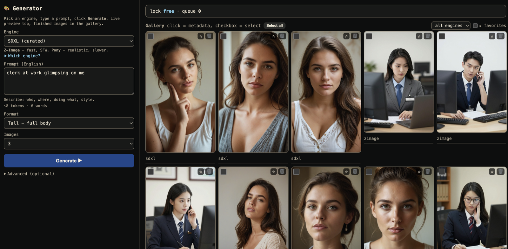

<div align="center">

# persona-gen

**Generate images on your Mac - fully local, fully private. No cloud, no account, no subscription.**

A clean web UI over two image engines, with a live preview that sharpens step by step and a
provenance sidecar for every image you make. Built for Apple Silicon.

[](https://github.com/nohardcoded/personas/actions/workflows/ci.yml)
[](LICENSE)


[Features](#features) · [Install](#quick-start-fresh-mac-to-first-image) · [Usage](#usage) · [Configuration](#configuration) · [Security](SECURITY.md) · [Troubleshooting](docs/TROUBLESHOOTING.md)



</div>

## What you get

- **Two engines, one UI** - **Z-Image** (fast, single-pass) and a curated **SDXL** chain
  (base -> realism refiner -> detector-gated face / feet / hands fixing). Bring your own checkpoints.
- **Live preview** - watch each image sharpen from a pixelated latent frame, with per-stage progress.
- **Provenance for every image** - a JSON sidecar (engine, seed, steps, cfg, size) sits next to
  each PNG; **Re-run (same seed)** or **Vary** any result in one click.
- **A real gallery** - favorite, filter by engine, multi-select, and bulk-delete.
- **Private by default** - binds `localhost` only, no telemetry, one heavy render at a time.
- **One-command install** - downloads the ungated Z-Image model and writes a working config,
  so you can generate immediately. No account, no token, no Hugging Face license to approve.
- **Config-driven** - every model path lives in `config.yaml`; nothing is hardcoded.

> **18+.** This app can generate adult/NSFW content - what comes out is driven entirely by your
> prompt and the model you load. A one-time 18+ confirmation gates the UI. You are responsible
> for what you create and for complying with local law and your models' licenses.

## Features

**Generate**
Pick an engine, type an English prompt, choose a format (portrait / tall / square / landscape /
wide - no "multiple of 16" math to get wrong), set how many images, hit **Generate**. Garbage
input is coerced and clamped, so a stray letter in a number field never crashes a render.

**Watch it happen**
A live latent preview goes from blocky to sharp as denoising proceeds, with the current stage
and step shown. The curated SDXL engine reports each refinement pass (skin -> face -> feet -> hands).

**Curate**
Every finished image lands in the gallery with a metadata sidecar. Click for the full provenance,
**Re-run** with the same seed for an identical image, or **Vary** for fresh seeds. Favorite the
keepers, filter by engine, select many, delete the rest.

**Stay in control**
A queue panel shows what's pending; remove or duplicate individual jobs, or stop everything.
One heavy render runs at a time under a lock file, so the app never thrashes your GPU.

## Quick start (fresh Mac to first image)

```bash
git clone <REPO-URL> persona-gen && cd persona-gen
bash scripts/install.sh        # Xcode CLT, uv, venv, deps; downloads Z-Image; writes config.yaml
bash scripts/run.sh            # opens http://localhost:7860, Z-Image ready out of the box
```

The installer downloads the Z-Image model (Apache-2.0, no account or token) and writes a working
`config.yaml`, so you can generate the moment it finishes. The optional curated SDXL engine needs
your own checkpoint - see [docs/MODELS.md](docs/MODELS.md).

Full walkthrough: [docs/QUICKSTART.md](docs/QUICKSTART.md) · models: [docs/MODELS.md](docs/MODELS.md)
· fixes: [docs/TROUBLESHOOTING.md](docs/TROUBLESHOOTING.md)

### System requirements

|              | Minimum                          | Recommended                              |
|--------------|----------------------------------|------------------------------------------|
| **Chip**     | Apple Silicon - M1               | M1 Pro/Max, M2, M3 or newer              |
| **macOS**    | 13 (Ventura)                     | latest                                   |
| **Unified RAM** | 16 GB                         | 32 GB+ (needed for the curated SDXL chain) |
| **Free disk**   | ~20 GB (Z-Image model is ~16 GB) | 50 GB+ if you add SDXL checkpoints     |
| **Python**   | 3.12 - installed for you by `install.sh` via `uv` |                     |

- **Apple Silicon only.** This app uses Metal (MPS); **Intel Macs are not supported.**
- The **first** image after launch is slower while the model warms up; later renders are faster.
- Rough speeds on an M3 Max: **Z-Image ~60-70 s/image**, curated **SDXL ~250 s/image** (more
  stages, higher quality). Smaller/older chips will be slower.

## Usage

1. `bash scripts/run.sh` - the app starts and opens `http://localhost:7860` in your browser.
2. Confirm 18+, pick **Z-Image**, type a prompt (e.g. *"a fit woman working out at the gym,
   candid photo, natural light"*), click **Generate**.
3. Watch the live preview at the top; the finished image drops into the gallery on the right.
4. Click any image for its metadata, then **Re-run** or **Vary** to iterate.

Want it reachable from another device on your network? It is **off by default** for safety
(the app has no auth). Opt in explicitly, at your own risk:

```bash
HOST=0.0.0.0 bash scripts/run.sh
```

## Configuration

All model paths live in `config.yaml` (the installer writes one; `config.example.yaml` documents
every field). Z-Image works out of the box. The curated SDXL engine is entirely optional and each
refinement stage is **auto-skipped if its model isn't set** - so you can enable just the parts you
have. See [docs/MODELS.md](docs/MODELS.md) for where to get checkpoints.

## How it works

A single FastAPI process serves the UI and runs one background worker that drains a job queue,
keeps the chosen engine warm in memory, and renders one image at a time under a lock file. The
curated SDXL engine adds optional realism + face/feet/hands refinement; each stage is skipped
automatically when its model isn't configured. Nothing leaves your machine.

For the security model (localhost-by-default, DNS-rebinding/CSRF guards, input bounds, the
single-render lock), see [SECURITY.md](SECURITY.md).

## License

[MIT](LICENSE) - use it for anything, including commercially. Model weights you download have their
own licenses; this software does not bundle or redistribute them.
